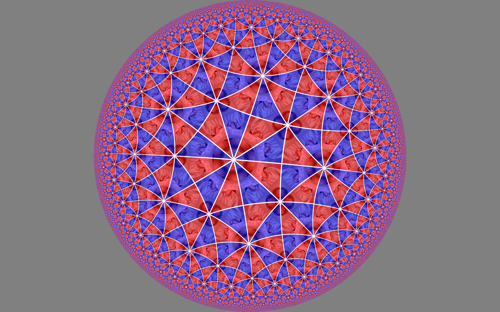
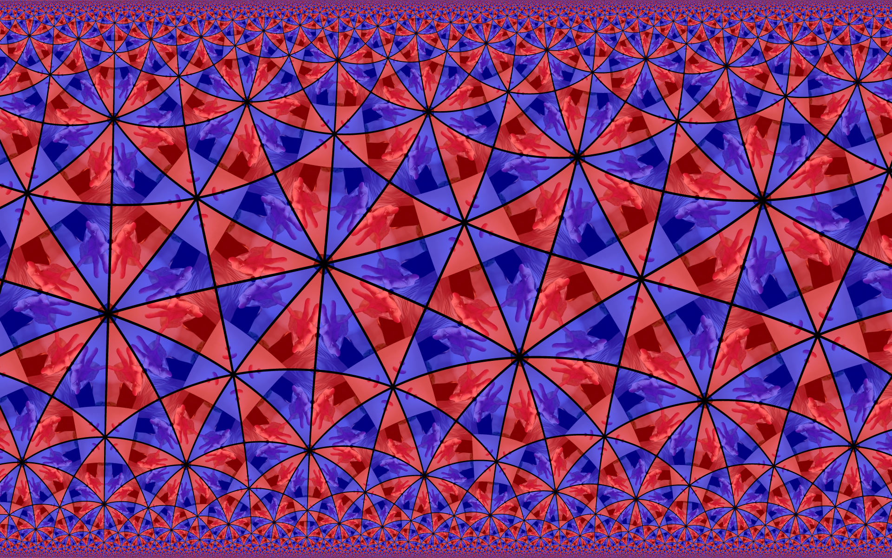
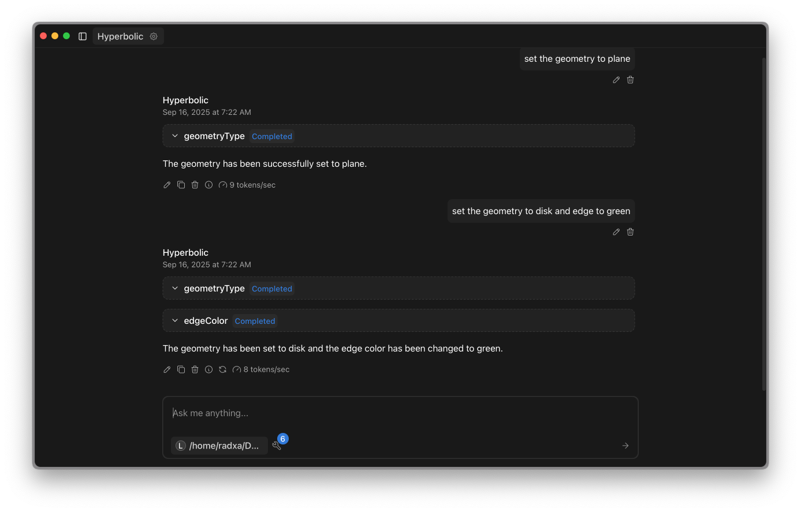

# README

The `hyperbolic` app displays a fullscreen shader with a video texture. It is a tiling of the hyperbolic plane. 



The tiling is defined by a group of symmetries and they can be changed.

The hyperbolic plane can either be represented as a disk or as a plane:



The video device can be passed as argument when launching the app:

`hyperbolic /dev/video5`

The app is exposing an MCP server on port 8100 and can be controlled by a LLM. Here is an example of a chat to change the settings of the hyperbolic app:




To use the app with a LLM you need:

* A LLM server. The `server.sh` shows how to laumch `llama-server` from `llama.cpp` project. An Open AI API compatible server will work
* A chat client that can talk to the open AI compatible interface and to MCP servers. For instance [Jan](https://jan.ai)


## To build 

`git clone --recurse-submodules https://github.com/christophe0606/shader_linux_glsl.git`

Some libraries are required for the UI

```bash
sudo apt install libglew-dev
sudo apt install libglfw3-dev
sudo apt install libgles2-mesa-dev
``` 

If you don't want to build but just use the excutable:

```bash 
sudo apt install libglfw3
sudo apt install libglew2.2
sudo apt install libgles2
```

Then use `cmake` to build.

## AI

Except the shader that is coming from an old experiment by the author, other parts of this demo have been generated a lot by chat GPT.

